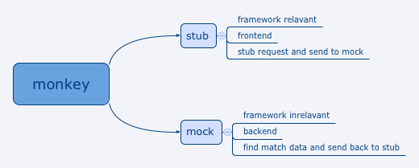

## Get Started

### Terminology

  * `monkey`: Data simulate system
  * `stub`: Frontend of monkey
  * `mock`: Backend of monkey
  * `request`: Normalized HTTP request, see docs in `mock-request2`
  * `response`: Simulate data, see docs in `mock-response`
  * `mapping`: Matching rule between request and response, see docs in `mock-locator`

`monkey` is a data simulate system consist of `stub` and `mock`.

`stub` is

  * framework relevant
  * the frontend of `monkey`
  * stub framework information such as HTTP request
  * transform it appropriately 
  * send it back to `mock`.

`mock`

  * consume predefined HTTP request
  * searching for matching simulate data in filesystem
  * send it back to `stub`




### Example

Below is a example of use `mock` to find simulate data match uri `/deal/123456`.

    var Mock = require('monkeyjs');
    var mock = new Mock('./data-dir');
    var data = mock.get({
        "uri": "/deal/123456",
        "method": "POST",
    });
    
`data` will be the content of file `./data-dir/deal/123456.POST.json` if it exists.

### API

#### `Mock(string: mount)`
Initialize a `mock` object with simulate data directory `mount`.

#### `mock#get(Object: request)`
Find simulate data match `request`

#### `mock#getByRPC(string: funcName, Array: args)`
Find simulate data match RPC call: function name `funcName` with arguments `args`.

As a matter of fact, `mock` transform RPC call to `/funcName?0=args[0]&1=args[1]...`, before locate matching simulate data.


### Stub

`stub` make `monkey` possible to adapt to every system, even with different programing languages.

#### stub-cli
For example, below is the simplest `stub`(`stub-cli`) comes with `mock` 

```js
#! /usr/bin/env node

// Simple cli stub for monkey

var Mock = require('..');
var argv = process.argv;

if (argv.length < 4) {
    console.log('Usage: ./mock <mock-data-dir> <http-request>');
    process.exit(1);
}

var mock = new Mock(argv[2]);
console.log(JSON.stringify(mock.get(JSON.parse(argv[3]))));
```

To use `stub-cli` inside a PHP framework,

```php
$response = shell_exec('./node_modules/.bin/mock ./data-dir ' . escapeshellarg(json_encode($request)));
```

It is the PHP framework's decision of how and where to use `mock`, as long as it construct `$request` properly.

`stub-cli` take the `mock-data-dir` and `http-request` argument, transform them, ask `mock` for simulate data and return(`log`) the `response` to the invoker.

#### stub-http
`stub-http` is a stand alone http server.

It accept normalized `request`, use `mock` to find simulate data and return the `response`.

Below is the key source code of `stub-http`

```js
// Usage ./stub-http [-p port] [-a address] <mock-data-dir>

var mock = new Mock(mount);

createServer(mock)
    .listen(8080, 'localhost');

function createServer(mock) {
    return http.createServer(function(req, res) {
        var chunks = [];
        I
        req.on('data', function(chunk) {
        });

        req.on('end', function(chunk) {
            if (chunk) { chunks.push(chunk); }

            var status = 200, content, type = 'application/json';
            try {
                var request = Buffer.concat(chunks).toString();

                var response = mock.get(request);

                if (!response) {
                    status = 404;
                }
                content = JSON.stringify(response);

            } catch (err) {
                content = err.stack;
                type = 'text/plain';

            } finally {
                res.writeHead(status, {
                    'Content-Length': Buffer.byteLength(content, 'utf8'),
                    'Content-Type': type,
                });
                res.end(content);
            }
        });
    });
}
```

To start `stub-http`, you must specify a simulate data directory for `mock` to searching for simulate data.

After accept a `request`, `http-stub` passing it to `mock.get`. `mock` will searching for available simulate data and return it. before send `response` back to client, `stub-http` check if the response is valid(if not, tell the client what's going on).

Example client code with PHP is following

```php
http_post_data('http://localhost:8080', array(
    uri: '/deal/123456',
    method: 'POST'
));
```

`stub-proxy` is a similar `stub` to `stub-http`.
